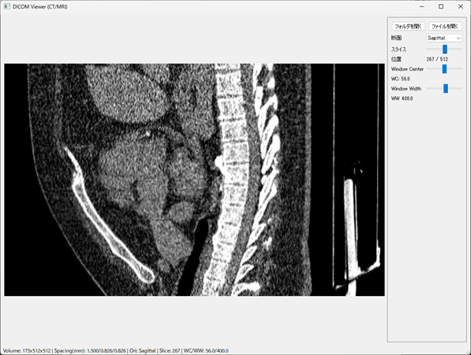

# DICOM Viewer

PyQt5 + pydicom + numpy による簡易DICOMシリーズビューア



## 機能
- DICOMシリーズ（ディレクトリ）または単一ファイル（マルチフレーム対応）を読み込み
- スライダーでスライス位置を変更
- Window Center/Width をスライダーで調整
- 断面（Axial / Coronal / Sagittal）切り替え

## 使用方法(Windowsの場合)
- `viewer.exe`を起動

## 使用方法(Linux等の場合)

### 依存パッケージのインストール
```
pip install -r requirements.txt
```

### 起動方法
```
python view.py
```

起動後、右ペインの「フォルダを開く」または「ファイルを開く」からDICOMデータを選択してください。

## 使い方
- 断面: Axial/Coronal/Sagittal を切替
- スライス: スライダーでスライス番号を変更
- Window Center/Width: スライダーで明るさ・コントラストを調整

## 注意
- 異なるシリーズが混在するフォルダを選ぶと、枚数が最大のシリーズを自動選択します。
- PhotometricInterpretation が MONOCHROME1 の場合は白黒を反転させます。
- 一部のDICOMではタグ不足により間隔やWL/WWが推定となることがあります。
